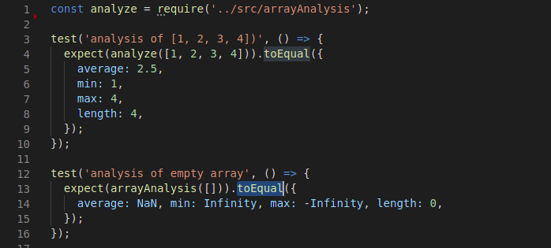

# testing-practice

Write tests for the functions in the src folder.
# Project Specification

1. capitalize(string) takes a string and returns that string with the first character capitalized.
2. reverseString(string) takes a string and returns it reversed.
3. A calculator object that contains the basic operations: add, subtract, divide, and multiply.
4. Caesar Cipher. Read about it on this website.
    - Don’t forget to test wrapping from z to a.
    - Don’t forget to test keeping the same case.
    - Don’t forget to test punctuation!
    - For this one, you may want to split the final function into a few smaller functions. One concept of Testing is that you don’t need to explicitly test every function you write… Just the public ones. So in this case you only need tests for the final caesar() function. If it works as expected you can rest assured that your smaller helper functions are doing what they’re supposed to.
5. Array Analysis. Write a function that takes an array of numbers and returns an object with the following properties: average, min, max, and length.

## Built With

- HTML5
- Javascript ES6
- Jest

## screenshots

### Index Page

### Prerequisites

- Chrome
- Javascript enabled

### Usage

- Fork/Clone this project to your local machine with the command `git clone https://github.com/tGodson/testing-practice.git`.
- Open folder in IDE.
- install jest with the command `npm install --save-dev jest`.
- run the command `npm run test` on the terminal of your IDE to test your code.

## Author

👤 **Tendongze Godson**

- Github: [tGodson](https://github.com/tGodson)
- Twitter: [@tendongze95](https://twitter.com/tendongze95)
- Linkedin: [linkedin](https://www.linkedin.com/in/tendongzegodson)

👤 **Mark James Kiptubei**

- Github: [@kiptubei](https://github.com/kiptubei)
- Twitter: [@mjabei](https://twitter.com/mjabei)
- Linkedin: [Mark James Kiptubei](https://www.linkedin.com/in/mark-james-k-aa875829/)

## 🤝 Contributing

Contributions and feature requests are welcome!

Start by:

- Forking the project
- Clone the project to your local machine by running `git clone https://github.com/tGodson/testing-practice.git`
- `cd` into the project directory
- Run `git checkout -b your-branch-name`
- Make your contributions
- Push your branch up to your forked repository
- Open a Pull Request with a detailed description to the development(or master if not available) branch of the original project for a review

## Show your support

Give a ⭐️ if you like this project!

## Acknowledgments

